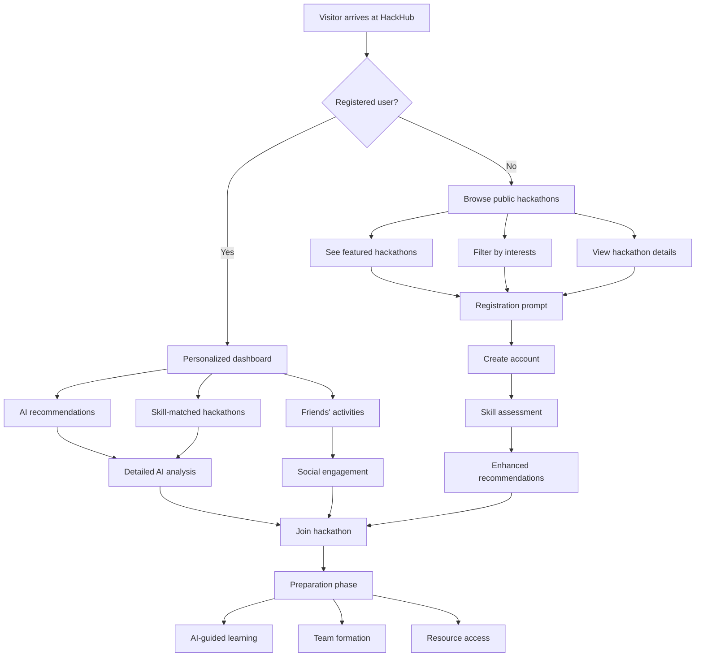
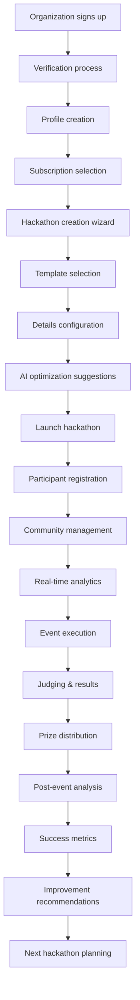
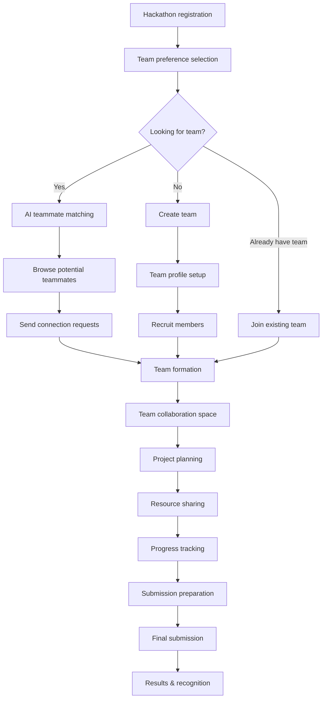

# HackHub: System Overview & Business Logic Guide

## Table of Contents
1. [Platform Overview](#platform-overview)
2. [User Journeys & Workflows](#user-journeys--workflows)
3. [Core Feature Ecosystem](#core-feature-ecosystem)
4. [AI-Driven Intelligence System](#ai-driven-intelligence-system)
5. [Communication & Collaboration Hub](#communication--collaboration-hub)
6. [Achievement & Recognition System](#achievement--recognition-system)
7. [Business Model & Revenue Flows](#business-model--revenue-flows)
8. [Platform Ecosystem & Network Effects](#platform-ecosystem--network-effects)
9. [Quality Assurance & Trust Building](#quality-assurance--trust-building)
10. [Scaling & Growth Strategy](#scaling--growth-strategy)

---

## Platform Overview

### The Core Problem HackHub Solves

**Before HackHub:**
- 🔍 **Discovery Crisis**: Brilliant developers miss amazing opportunities because hackathons are scattered across hundreds of different platforms, personal websites, and social media posts
- 🏢 **Organizer Struggles**: Companies host hackathons but struggle to reach quality participants, often getting limited engagement from their target audience
- 📊 **Fragmented Ecosystem**: No centralized way to track progress, build reputation, or showcase achievements across the hackathon community
- 🤝 **Missed Connections**: Talented individuals can't find each other, and companies can't discover emerging talent effectively

**After HackHub:**
- 🎯 **Unified Discovery**: One trusted platform where all quality hackathons are listed with comprehensive details, intelligent filtering, and personalized recommendations
- 🚀 **Guaranteed Reach**: Organizations get access to a verified community of skilled participants, ensuring quality engagement and innovative submissions
- 🏆 **Career Building**: Participants build verifiable portfolios, earn recognized achievements, and develop professional networks through a gamified experience
- 🤖 **AI-Powered Success**: Intelligent matching, real-time guidance, and personalized development paths maximize everyone's chances of success

### Platform Vision

HackHub transforms hackathons from isolated events into a **connected ecosystem** where every participation contributes to long-term career growth, every organization builds lasting relationships with talent, and every event becomes more successful through community knowledge and AI insights.

---

## User Journeys & Workflows

### 1. Participant Discovery Journey

**Key Touchpoints:**
- **First Impression**: Clean, modern interface showcasing featured hackathons with clear value propositions
- **Discovery Phase**: Advanced filtering (location, skill level, industry, prize pool, duration) with real-time results
- **Decision Support**: AI-powered hackathon analysis showing difficulty level, required skills, and success probability
- **Registration Flow**: Streamlined process with social login options and skill-based profile creation
- **Preparation Support**: Personalized learning paths, tool recommendations, and community connections

### 2. Organization Management Journey

**Key Features:**
- **Onboarding**: Guided setup with industry-specific templates and best practice recommendations
- **Creation Tools**: Drag-and-drop hackathon builder with AI-powered optimization suggestions
- **Participant Management**: Real-time dashboard showing registrations, engagement metrics, and participant profiles
- **Communication Hub**: Integrated messaging, announcement system, and community management tools
- **Analytics Dashboard**: Comprehensive insights into participant behavior, engagement patterns, and success metrics

### 3. Team Formation & Collaboration Journey

**Collaboration Features:**
- **Smart Matching**: AI algorithms match participants based on complementary skills, availability, and working preferences
- **Team Workspaces**: Integrated project management tools, file sharing, and communication channels
- **Progress Tracking**: Visual project timeline, milestone tracking, and automated progress reports
- **Mentor Integration**: Access to industry mentors for guidance, code reviews, and strategic advice

---

## Core Feature Ecosystem

### 1. Intelligent Hackathon Discovery Engine

**Public Marketplace Features:**
- **Dynamic Filtering System**: Multi-dimensional search across skill requirements, industries, difficulty levels, time commitments, and geographic preferences
- **Real-time Status Tracking**: Live updates on registration numbers, time remaining, and event phases
- **Social Proof Integration**: Participant testimonials, success stories, and community ratings
- **Calendar Integration**: Personal calendar sync with deadline reminders and milestone notifications

**AI-Enhanced Discovery:**
- **Personalized Recommendations**: Machine learning algorithms analyze user behavior, skills, and preferences to suggest optimal hackathons
- **Success Probability Scoring**: AI models predict likelihood of success based on individual profile and hackathon characteristics
- **Skill Gap Analysis**: Intelligent identification of missing skills with personalized learning path recommendations
- **Trending Detection**: Real-time analysis of emerging technologies and hackathon themes

### 2. Comprehensive Organization Portal

**Event Management Suite:**
- **Template Library**: Industry-specific hackathon templates with proven success patterns
- **Collaborative Planning**: Multi-user editing with role-based permissions and approval workflows
- **Resource Management**: Centralized hub for sharing APIs, datasets, documentation, and development tools
- **Timeline Automation**: Automated milestone tracking, reminder systems, and deadline management

**Participant Engagement Tools:**
- **Communication Center**: Multi-channel messaging system with announcements, Q&A forums, and direct messaging
- **Real-time Analytics**: Live dashboard showing registration trends, participant engagement, and demographic insights
- **Custom Branding**: White-label options with organization logos, color schemes, and custom domains
- **Integration Ecosystem**: Seamless connections with Slack, Discord, GitHub, and other collaboration tools

### 3. AI-Powered Participant Experience

**Preparation & Learning:**
- **Personalized Learning Paths**: AI-curated educational content based on hackathon requirements and individual skill gaps
- **Tool Recommendations**: Intelligent suggestions for frameworks, libraries, APIs, and development environments
- **Resource Libraries**: Automatically updated collections of tutorials, documentation, and code samples
- **Practice Challenges**: Mini-hackathons and coding challenges to build relevant skills

**Real-time Assistance:**
- **AI Coding Assistant**: Context-aware help with debugging, optimization suggestions, and best practice guidance
- **Project Feasibility Analysis**: Real-time assessment of project scope, timeline viability, and technical complexity
- **Strategic Guidance**: AI-powered recommendations for project pivots, feature prioritization, and presentation strategies
- **Performance Insights**: Continuous analysis of progress with actionable improvement suggestions

### 4. Advanced Team Dynamics System

**Intelligent Team Formation:**
- **Compatibility Scoring**: Multi-factor analysis considering technical skills, soft skills, time zones, and working preferences
- **Role-Based Matching**: Automatic identification of complementary roles (developer, designer, product manager, domain expert)
- **Diversity Optimization**: Algorithms promote diverse team compositions for enhanced creativity and problem-solving
- **Dynamic Rebalancing**: Real-time suggestions for team adjustments based on project evolution and member availability

**Collaboration Excellence:**
- **Integrated Workspaces**: Unified environment combining code repositories, design tools, project management, and communication
- **Progress Visualization**: Real-time dashboards showing individual contributions, team velocity, and milestone completion
- **Conflict Resolution**: AI-powered mediation suggestions and escalation procedures for team challenges
- **Knowledge Sharing**: Automated documentation generation and best practice sharing across teams

---

## AI-Driven Intelligence System

### 1. Hackathon Analysis Engine

**Automated Content Analysis:**
- **Requirement Extraction**: Natural language processing to identify technical requirements, skill needs, and project constraints from hackathon descriptions
- **Difficulty Assessment**: Multi-dimensional analysis considering technical complexity, time constraints, and resource availability
- **Technology Mapping**: Automatic identification of relevant tools, frameworks, and technologies based on project themes
- **Success Pattern Recognition**: Analysis of historical data to identify factors contributing to winning submissions

**Predictive Modeling:**
- **Participation Forecasting**: Prediction of registration numbers, participant demographics, and engagement levels
- **Success Probability Calculation**: Individual and team-based likelihood assessments for different achievement levels
- **Resource Requirement Estimation**: Intelligent estimation of time, skills, and tools needed for project completion
- **Market Trend Analysis**: Identification of emerging technologies and industry demands reflected in hackathon themes

### 2. Personalized Recommendation Engine

**Individual Optimization:**
- **Skill-Based Matching**: Analysis of current capabilities against hackathon requirements with gap identification
- **Interest Alignment**: Correlation of personal preferences, career goals, and project themes
- **Schedule Optimization**: Integration of availability, time zone considerations, and competing commitments
- **Growth Path Planning**: Long-term career development recommendations based on participation patterns

**Dynamic Learning:**
- **Behavioral Analysis**: Continuous learning from user interactions, preferences, and feedback
- **Performance Tracking**: Analysis of past participation outcomes to refine future recommendations
- **Community Intelligence**: Leveraging collective user behavior to improve individual suggestions
- **External Integration**: Incorporation of data from GitHub, LinkedIn, and other professional platforms

### 3. Real-Time Assistance Framework

**Development Support:**
- **Code Quality Analysis**: Real-time review of code submissions with improvement suggestions
- **Architecture Guidance**: High-level design recommendations based on project requirements and constraints
- **Performance Optimization**: Automated identification of bottlenecks and optimization opportunities
- **Security Assessment**: Vulnerability scanning and security best practice recommendations

**Strategic Advisory:**
- **Project Scope Management**: Continuous assessment of feature feasibility within time constraints
- **Presentation Optimization**: AI-powered suggestions for demo structure, key messaging, and visual design
- **Judging Criteria Alignment**: Real-time analysis of submission alignment with evaluation criteria
- **Competitive Analysis**: Insights into other team approaches and differentiation opportunities

---

## Communication & Collaboration Hub

### 1. Multi-Channel Communication System

**Organization-to-Participant Communication:**
- **Announcement Broadcasting**: Targeted messaging system with priority levels and delivery tracking
- **Update Propagation**: Real-time distribution of schedule changes, resource updates, and important notifications
- **Q&A Management**: Structured question-and-answer system with expert moderation and AI-assisted responses
- **Feedback Collection**: Automated survey systems for continuous improvement and participant satisfaction tracking

**Participant-to-Participant Interaction:**
- **Community Forums**: Topic-based discussion spaces for technical questions, team formation, and knowledge sharing
- **Direct Messaging**: Secure, encrypted communication channels for team coordination and private discussions
- **Social Features**: User profiles, activity feeds, and social networking capabilities for community building
- **Mentorship Connections**: Structured matching system connecting participants with industry experts and experienced hackers

### 2. Real-Time Collaboration Tools

**Integrated Development Environment:**
- **Code Collaboration**: Real-time collaborative coding with version control integration and conflict resolution
- **Design Sharing**: Integrated design tools for wireframing, prototyping, and visual asset creation
- **Documentation Management**: Collaborative documentation platform with real-time editing and version tracking
- **Resource Sharing**: Centralized repository for team assets, research materials, and development resources

**Project Management Integration:**
- **Task Management**: Automated task creation, assignment, and progress tracking based on project requirements
- **Timeline Visualization**: Dynamic Gantt charts and milestone tracking with automatic deadline adjustments
- **Progress Monitoring**: Real-time dashboards showing individual contributions and team velocity metrics
- **Risk Assessment**: Automated identification of potential roadblocks and mitigation strategy suggestions

### 3. External Platform Integration

**Popular Tool Connectivity:**
- **Version Control**: Seamless integration with GitHub, GitLab, and Bitbucket for code management
- **Communication Platforms**: Bridge connections to Slack, Discord, Microsoft Teams, and other messaging tools
- **Design Tools**: Integration with Figma, Adobe Creative Suite, and other design platforms
- **Cloud Services**: Direct connections to AWS, Google Cloud, Azure, and other infrastructure providers

**API Ecosystem:**
- **Developer APIs**: Comprehensive API access for custom integrations and third-party tool development
- **Webhook System**: Real-time event notifications for external system synchronization
- **Data Export**: Flexible data export options for analysis, reporting, and integration with existing workflows
- **Single Sign-On**: Enterprise-grade authentication integration with organizational identity systems

---

## Achievement & Recognition System

### 1. Dynamic Achievement Framework

**Tiered Recognition System:**
- **Participation Badges**: Recognition for various levels of engagement, from registration to completion
- **Skill Achievements**: Technical competency badges for demonstrating proficiency in specific technologies or methodologies
- **Leadership Recognition**: Acknowledgment of team leadership, mentoring, and community contribution
- **Innovation Awards**: Special recognition for creative solutions, technical excellence, and breakthrough thinking

**Progressive Skill Development:**
- **Competency Tracking**: Continuous assessment of skill progression through hackathon participation
- **Certification Pathways**: Structured learning tracks leading to industry-recognized certifications
- **Portfolio Building**: Automated compilation of projects, achievements, and recommendations into professional portfolios
- **Career Advancement Metrics**: Tracking of professional growth indicators and career milestone achievements

### 2. Custom Certificate Generation System

**Organization-Branded Certification:**
- **Template Customization**: Flexible certificate designer with brand integration and custom messaging
- **Dynamic Content Generation**: Automatic population of participant details, achievement specifics, and organizational information
- **Multi-Format Support**: Generation of digital certificates, printable PDFs, and blockchain-verified credentials
- **Social Sharing Integration**: One-click sharing capabilities for LinkedIn, social media, and professional networks

**Verification & Authenticity:**
- **Blockchain Integration**: Immutable credential verification using distributed ledger technology
- **QR Code Authentication**: Scannable verification codes linking to detailed achievement records
- **Third-Party Integration**: Compatibility with professional credential platforms and HR systems
- **Anti-Fraud Measures**: Advanced security features preventing certificate tampering and unauthorized reproduction

### 3. Motivational Engagement System

**Success Celebration:**
- **Personalized Congratulations**: AI-generated celebration messages tailored to individual achievements and participation levels
- **Community Recognition**: Public acknowledgment through platform feeds, featured stories, and community spotlights
- **Milestone Tracking**: Visual progress indicators showing advancement through skill levels and career stages
- **Achievement Galleries**: Showcase spaces for displaying certificates, badges, and project portfolios

**Resilience & Growth Support:**
- **Constructive Feedback**: AI-powered analysis of non-winning submissions with specific improvement recommendations
- **Learning Opportunities**: Personalized suggestions for skill development based on performance gaps
- **Mentorship Matching**: Connection with experienced community members for guidance and support
- **Retry Encouragement**: Intelligent identification of suitable follow-up hackathons for continued growth

---

## Business Model & Revenue Flows

### 1. Subscription-Based Revenue Tiers

**Individual Participant Subscriptions:**
- **Free Tier**: Basic hackathon discovery, registration capabilities, and limited AI recommendations
- **Premium Individual ($15/month)**: Full AI assistant access, advanced analytics, unlimited team formation tools, and priority support
- **Pro Individual ($29/month)**: Additional features including mentor access, career coaching, and advanced portfolio tools

**Organization Subscriptions:**
- **Starter ($99/month)**: Basic hackathon hosting for up to 3 events annually with standard analytics and support
- **Professional ($299/month)**: Unlimited hackathons, advanced participant analytics, custom branding, and priority listing
- **Enterprise ($599/month)**: White-label solutions, API access, dedicated support, and advanced integration capabilities

### 2. Transaction-Based Revenue

**Platform Commission Structure:**
- **Prize Distribution**: 3-5% commission on prize money processing and distribution
- **Registration Fees**: Processing fee for paid hackathon registrations
- **Premium Placements**: Featured listing fees for enhanced hackathon visibility
- **Sponsored Content**: Revenue from promoted hackathons and partner content

**Value-Added Services:**
- **Custom Certificate Generation**: Premium fee for advanced certificate customization and branded templates
- **Extended Analytics**: Detailed performance reports and participant insights for organizations
- **Consulting Services**: Expert hackathon strategy and execution consulting
- **Training Programs**: Specialized workshops and educational content for participants and organizers

### 3. Ecosystem Revenue Opportunities

**Partnership Revenue:**
- **Technology Integrations**: Revenue sharing with integrated tool providers and platforms
- **Educational Content**: Partnerships with online learning platforms and certification providers
- **Recruitment Services**: Job placement fees for successful candidate matches through the platform
- **Sponsorship Facilitation**: Commission on sponsor-hackathon matching and partnership facilitation

**Data & Analytics Services:**
- **Market Intelligence**: Anonymized trend reports and industry insights for enterprise clients
- **Talent Pipeline Data**: Recruitment analytics and candidate sourcing for enterprise partners
- **Innovation Tracking**: Research reports on emerging technologies and industry developments
- **Benchmarking Services**: Comparative performance analysis for organizations and participants

---

## Platform Ecosystem & Network Effects

### 1. Multi-Sided Market Dynamics

**Participant Network Effects:**
- **Social Discovery**: More participants create richer social graphs and improved friend-based recommendations
- **Skill Diversity**: Broader participant base enables better team formation and collaborative opportunities
- **Knowledge Sharing**: Larger community generates more valuable insights, tips, and collaborative content
- **Reputation Building**: Expanded network increases value of achievements and professional recognition

**Organization Benefits:**
- **Talent Pool Growth**: Larger participant base provides access to more diverse and skilled candidates
- **Cross-Pollination**: Multiple organizations sharing the platform creates innovation through idea exchange
- **Best Practice Sharing**: Community-driven knowledge base of successful hackathon strategies and formats
- **Collaborative Opportunities**: Platform facilitates cross-organizational partnerships and joint events

### 2. Data-Driven Network Enhancement

**Intelligence Amplification:**
- **Recommendation Accuracy**: More user data improves AI recommendation quality for all participants
- **Success Pattern Recognition**: Larger dataset enables better prediction models and success strategies
- **Personalization Improvement**: Enhanced user profiling capabilities benefit the entire community
- **Trend Identification**: Early detection of emerging technologies and industry shifts

**Quality Assurance Evolution:**
- **Community Moderation**: Self-regulating community with peer review and quality control mechanisms
- **Reputation Systems**: Multi-dimensional trust and quality metrics based on community feedback
- **Content Curation**: User-generated content filtering and quality enhancement through community participation
- **Fraud Prevention**: Collective intelligence for identifying and preventing fraudulent activities

### 3. Ecosystem Expansion Strategy

**Vertical Integration:**
- **Educational Partnerships**: Integration with universities, coding bootcamps, and online learning platforms
- **Corporate Integration**: Deep partnerships with enterprise innovation programs and internal hackathon initiatives
- **Industry Specialization**: Vertical-specific platforms for healthcare, fintech, sustainability, and other sectors
- **Global Expansion**: Localized platforms with region-specific content, languages, and cultural adaptations

**Horizontal Expansion:**
- **Related Event Types**: Expansion into design competitions, innovation challenges, and startup competitions
- **Professional Development**: Career coaching, skill assessment, and professional networking services
- **Recruitment Platform**: Full-featured talent acquisition and job placement services
- **Innovation Consulting**: Enterprise consulting for innovation strategy and execution

---

## Quality Assurance & Trust Building

### 1. Participant Verification System

**Identity & Skill Verification:**
- **Multi-Factor Authentication**: Secure account creation with email, phone, and social media verification
- **Skill Assessment Integration**: Automated coding challenges and portfolio reviews to verify technical capabilities
- **Professional Network Verification**: LinkedIn and GitHub integration for professional background confirmation
- **Community Vouching**: Peer recommendation and endorsement systems for reputation building

**Behavior Monitoring:**
- **Participation Quality Metrics**: Tracking of engagement levels, project completion rates, and community contributions
- **Anti-Gaming Measures**: Detection and prevention of fake accounts, spam, and manipulative behavior
- **Feedback Integration**: Continuous improvement based on community feedback and reported issues
- **Appeals Process**: Fair and transparent system for addressing account restrictions and disputes

### 2. Organization Credibility Framework

**Verification Requirements:**
- **Business Registration**: Verification of legal business status and organizational legitimacy
- **Financial Verification**: Confirmation of ability to pay prizes and fulfill commitments
- **Reference Checking**: Validation through previous event history, partner testimonials, and industry connections
- **Compliance Monitoring**: Ongoing assessment of adherence to platform policies and community standards

**Quality Standards:**
- **Event Standards**: Minimum requirements for hackathon structure, clarity, and participant value
- **Communication Guidelines**: Standards for professional communication and participant engagement
- **Prize Fulfillment Tracking**: Monitoring of prize distribution and commitment fulfillment
- **Continuous Monitoring**: Ongoing assessment of organization behavior and community impact

### 3. Community Safety & Moderation

**Content Moderation:**
- **Automated Screening**: AI-powered detection of inappropriate content, spam, and policy violations
- **Human Review Process**: Expert moderation team for complex cases and community disputes
- **Community Reporting**: Easy-to-use reporting system for community members to flag issues
- **Transparent Policies**: Clear community guidelines and enforcement procedures

**Safe Environment Creation:**
- **Anti-Harassment Policies**: Comprehensive protection against discrimination, harassment, and abuse
- **Privacy Protection**: Strong data protection measures and user privacy controls
- **Inclusive Design**: Platform features and policies promoting diversity, equity, and inclusion
- **Support Resources**: Access to counseling, mediation, and conflict resolution services

---

## Scaling & Growth Strategy

### 1. Geographic Expansion Framework

**Localization Strategy:**
- **Cultural Adaptation**: Platform customization for regional preferences, business practices, and cultural norms
- **Language Support**: Multi-language interface with native-speaking community management teams
- **Local Partnerships**: Strategic alliances with regional technology organizations, universities, and government initiatives
- **Regulatory Compliance**: Adaptation to local data protection, financial, and business regulations

**Market Entry Approach:**
- **Tier 1 Markets**: Focus on established technology hubs with strong hackathon cultures (Silicon Valley, London, Tel Aviv, Singapore)
- **Emerging Markets**: Strategic expansion into growing technology ecosystems with high developer populations
- **University Partnerships**: Campus-based expansion through academic partnerships and student organization collaborations
- **Corporate Pilots**: Enterprise-focused expansion through internal innovation program partnerships

### 2. Technology Scaling Architecture

**Infrastructure Scalability:**
- **Microservices Architecture**: Modular system design enabling independent scaling of different platform components
- **Global CDN Integration**: Worldwide content delivery optimization for fast, reliable user experiences
- **Database Sharding**: Geographic and functional data distribution for optimal performance and compliance
- **Auto-Scaling Systems**: Dynamic resource allocation based on usage patterns and demand fluctuations

**Performance Optimization:**
- **Caching Strategies**: Multi-layer caching for improved response times and reduced server load
- **Load Balancing**: Intelligent traffic distribution across multiple servers and geographic regions
- **API Rate Limiting**: Sophisticated throttling systems to ensure fair usage and prevent abuse
- **Monitoring & Analytics**: Comprehensive performance tracking and predictive scaling capabilities

### 3. Community Growth & Engagement

**Organic Growth Mechanisms:**
- **Referral Programs**: Incentivized sharing systems encouraging existing users to invite friends and colleagues
- **Content Marketing**: High-quality educational content attracting developers and organizations through search and social media
- **Success Story Amplification**: Strategic promotion of participant and organization success stories
- **Community Events**: Platform-sponsored meetups, workshops, and virtual events building brand awareness

**Strategic Partnership Development:**
- **Developer Tool Integrations**: Partnerships with popular development tools and platforms for mutual user acquisition
- **Educational Institution Alliances**: Formal partnerships with universities and coding schools for student engagement
- **Corporate Innovation Programs**: Integration with enterprise innovation initiatives and accelerator programs
- **Industry Conference Presence**: Active participation in major technology conferences and developer events

### 4. Product Evolution & Innovation

**Feature Development Pipeline:**
- **User-Driven Roadmap**: Product development prioritization based on community feedback and usage analytics
- **Experimental Features**: Beta testing program for new capabilities with engaged user communities
- **AI Enhancement**: Continuous improvement of artificial intelligence capabilities through expanded datasets and user feedback
- **Integration Ecosystem**: Ongoing expansion of third-party integrations and API partnerships

**Emerging Technology Integration:**
- **Blockchain & Web3**: Integration of decentralized technologies for credential verification and token-based incentives
- **Virtual & Augmented Reality**: Support for immersive hackathon experiences and virtual collaboration
- **Mobile-First Development**: Enhanced mobile applications for improved accessibility and engagement
- **Voice & Conversational AI**: Natural language interfaces for improved user interaction and accessibility

---

## Success Metrics & KPIs

### Platform Health Indicators
- **Monthly Active Users (MAU)**: Growth and retention across all user segments
- **Network Density**: Connections and interactions between participants and organizations
- **Content Quality**: User-generated content volume and community engagement rates
- **Transaction Volume**: Revenue generation and economic activity on the platform

### Community Impact Measurements
- **Career Advancement**: Tracking of participant job placements, promotions, and skill development
- **Innovation Outcomes**: Patents, startup creation, and product launches resulting from platform activities
- **Knowledge Transfer**: Cross-pollination of ideas and technologies across different industries and regions
- **Diversity & Inclusion**: Representation metrics and inclusive community growth indicators

### Business Performance Metrics
- **Revenue Growth**: Subscription revenue, transaction fees, and partnership income
- **Customer Acquisition Cost (CAC)**: Efficiency of marketing and growth investments
- **Lifetime Value (LTV)**: Long-term revenue potential and customer retention
- **Market Penetration**: Share of global hackathon market and competitive positioning

This comprehensive system overview demonstrates how HackHub creates a self-reinforcing ecosystem where every participant, organization, and interaction contributes to the platform's value and the community's success. The interconnected nature of features, the AI-driven intelligence layer, and the focus on long-term relationship building position HackHub as more than just a hackathon discovery platform—it's a career development and innovation ecosystem that grows stronger with every user and every event.